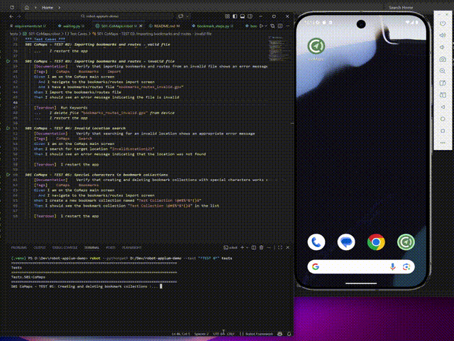

# Mobile testing framework with Appium and Robot Framework

This repository contains a small mobile UI test framework built on top of Robot Framework, Appium, and custom Python libraries.

The framework keeps the Robot layer thin and pushes implementation details into Python modules. That separation makes the tests easier to read while keeping the automation code reusable and maintainable.



## Requirements
- Python 3.12+
- Appium Server 3.x
- Appium `uiautomator2@7.x` driver
- Android device or emulator with the application under test installed (CoMaps)

Install Python dependencies:

```bash
pip install -r requirements.txt
```

Start Appium with `adb shell` access enabled. This is required because the framework uses mobile shell commands for file cleanup on the device.

```bash
appium --allow-insecure=uiautomator2:adb_shell
```

## Running tests
Depending on your environment, you may need to add the project root to the Python path:

```bash
robot --pythonpath <full path>/robot-appium-demo tests
```

## Architecture overview
The framework is organised as a layered test automation stack:

1. Robot test suites define business-readable scenarios.
2. Step libraries expose Robot keywords implemented in Python.
3. Page Object Model classes encapsulate screen-specific behavior and locators.
4. Action classes provide reusable Appium primitives such as clicking, typing, waiting, and device file operations.
5. A shared context stores the active driver session so all layers operate on the same application instance.

### Layer responsibilities

#### 1. Test suite layer
Location: `tests/`

Robot suites contain the executable scenarios and assertions from a user perspective.

#### 2. Step library layer
Location: `libs/RobotAppium/steps/`

Step libraries are the boundary between Robot syntax and Python implementation.

Responsibilities:
- expose Robot keywords via `@keyword`
- keep Robot-facing methods short and readable
- delegate actual UI behavior to page objects and shared actions

#### 3. Page Object Model layer
Location: `libs/RobotAppium/pom/`

Page objects group locators and UI workflows by feature or screen.

Responsibilities:
- define Appium locators in one place
- model feature-specific flows
- hide selector details from the test and step layers

#### 4. Action layer
Location: `libs/RobotAppium/actions/`

The action layer contains reusable low-level automation helpers.

This layer is intentionally generic so it can be reused across multiple page objects and future features.

#### 5. Shared context layer
Location: `libs/RobotAppium/context.py`

The `Context` object stores the active application session in an application cache. The module is exposed through `libs/RobotAppium/__init__.py`, which creates a shared `context` instance.

Without this shared context, each helper class would need to pass the driver around explicitly.

### Project structure

```text
tests/
	Robot suites with business-readable scenarios

libs/RobotAppium/
	__init__.py         Shared context bootstrap
	context.py          Driver cache and current application access
	steps/              Robot keyword implementations
	pom/                Page objects and feature-specific locators
	actions/            Reusable Appium/device/wait helpers
	utils/              Logging helpers

data/
	Test data files used by scenarios, such as GPX imports
```

### Design intent
This framework follows a practical separation of concerns:
- Robot Framework is used for readable scenario definitions
- Python is used for maintainable automation logic
- page objects isolate UI knowledge
- shared actions reduce duplication
- a shared context keeps driver management simple

That split is useful once the suite grows beyond a handful of tests, because it avoids pushing too much logic into Robot syntax.

## FAQ

### Why not use AppiumLibrary?
- It currently has limited maintenance activity, which is a risk for a core dependency.
- Real projects almost always need custom mobile behavior, and mixing a third-party keyword library with many custom low-level keywords tends to produce an inconsistent test API.
- Heavy business logic in Robot syntax does not scale well when the test set expands or when the framework needs to support multiple devices, OS versions, or both Android and iOS.
- Using Appium directly provides full control and makes it easier to build stable and fast tests.

### Known issues
- The structure is a bit overcomplicated for a project of this size, but the benefits should be more visible with a larger set of tests.
- The locators are not quite optimal, unfortunately the selected app was not very accessible.
- Some components should be separated from the POM files into component files, such as bottom sheets and input dialogs with buttons.


